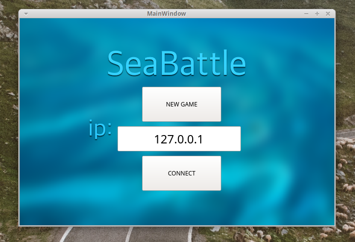

# seaBattle-qt

Client-server game "Sea Battle".
Developed in QT.


***

<h2> Requirements: </h2>

```
Qt5
```

<h2> Running: </h2>

```
git clone https://github.com/vadrx/seaBattle-qt
cd seaBattle-qt
qtcreator seaBattle.pro
```
Build project and run it.